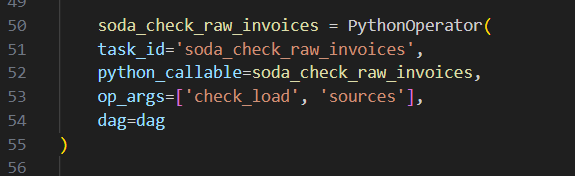
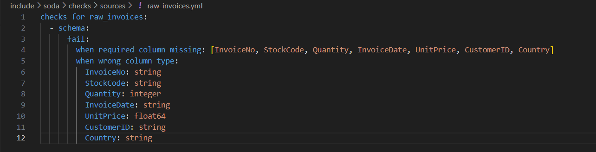

<h1 style="display: inline-block;"> Retail Data End to End Data Engineering Project on Google Cloud Platform Orchestrated by Airflow </h1>

## Dataset
The "Online Retail II" dataset contains transactions from a UK-based online retail company. The data covers the period from 01/12/2009 to 09/12/2011 and includes sales of unique all-occasion giftware. The customer base primarily consists of wholesalers.
Dataset Link: [Online Retail Dataset](https://www.kaggle.com/datasets/mashlyn/online-retail-ii-uci)

## 📝 Table of Contents
1. [Project Overview](#introduction)  
2. [Project and DAG Architecture](#project-architecture)  
  2.1. [Installation and Initialization](#install-initiate)  
  2.2. [Data Ingestion](#data-ingestion)  
  2.3. [Data Loading](#data-loading)  
  2.4. [Data Quality Check (Raw Data)](#soda_raw)  
  2.5. [Data Transformation and Modeling](#dbt_transform_modeling)  
  2.6. [Data Quality Check (Transformed Data)](#soda_transformed)  
  2.7. [Data Transformation (Dimensional to Multi-Dimensional)](#dbt_toplayer_tables)  
  2.8. [Data Quality Check (Top Layer Data)](#soda_toplayer)  
  2.9. [Data Reporting](#data-reporting)  
3. [Credits](#credits)  
4. [Contact](#contact)  

## 🔬 Project Overview 

This project is an end-to-end Data Engineering project orchestrated by Airflow, using multiple technologies, and applied on the Google Cloud platform. Online Retail Dataset is used for this project.  
In first step, Astro CLI and its dependicies are installed. Astro CLI is a open source commandline interface tool which is used for install, initialize and use airflow in local so easily. It also build file and folder template which is necessary for airflow usage. It creates a container to setup airflow, deploy and run defined dags in the container by using Docker.  
In next step,retail dataset is pushed to Google Bucket Storage from defined container environment(local env). Then it is loaded into Google BigQuery Data Warehouse.  
In next step, Data Quality check is applied by open source tool SODA. It has useful logging and alert functions to detect any inconsistencies during ETL processing of data with so basic yaml file definitions. After that, Raw Data is investigated and Data Modeling is applied by DBT, which is easy to implement, capable to high-lineage an open source tool used for transformation process of ETL. In this part, fact and dim tables are created into BigQuery Data Warehouse.  
After data quality check by SODA, top layer, multi dimensional tables are created by transformation of dbt and last part, Retail Analytic Report is created in Google Looker Studio by using top layer transformed data.
Each step which are described above represents a task in Retail DAG. You can see DAG structure and all tasks in detail in below. 

## 📝 Project Architecture

You can find the detailed information on the diagram below:

---------------------------

Retail Dag Architecture:

---------------------------

### 📤 Installation and Initialization
- Astro CLI and its prerequisites are installed and Astro project is initialized.
- Astro project image is started and airflow server is published in localhost server.
- Retail dataset is copied into local 'include' file in retail astro project which is also copied into project container running airflow app.
- All initialization steps in Google Cloud Platform side is completed.(create new project, bucket, create service account json file with bigquery,storage admin role to access and connect GCP)
- Requirements are installed.

  

### 📤 Data Ingestion
- retail.py file is created for Retail DAG implementation.
- Retail dataset is pushed to Google Bucket Storage from defined container environment(local env) by new task implementation in retail1 DAG as shown below:

  

### ⚙️ Data Loading
- Raw data pushed into Bucket Storage is loaded into Google BigQuery Data Warehouse by implementing new 2 task in retail1 DAG.
- First task create an empty table with defined schema informations.
- Second task apply loading process.

### 📥 Data Quality Check(for Raw Data)
- Data Quality check is applied by open source tool SODA for raw data just loaded in BigQuery by creating a new task in retail1 DAG.

- This check consists basic steps like data type and column name.

### 📊 Data Modeling and Transformation
- Data Modeling design is done and transformation scripts are implemented which is used by dbt to create new dimensional model in BigQuery.

  

### 📊 Data Quality Check(for fact and dim tables)
- Data Quality check is applied by open source tool SODA for dimensional model data just transformed in BigQuery by creating a new task in retail1 DAG.

- This check consists detailed steps like:
    -   All weekdays are in range 0-6
    -   All datetimes,customers,products are unique
    -   Price,total amounts must be greater than zero etc.

### 📊 Data Transformation
- Data transformation scripts are implemented to create multi-dimensional top layer tables to feed the report directly by dbt tool.

- Process is implemented in retail1 DAG as task.

### 📊 Data Quality Check(for top-layer tables)
- Data Quality check is applied by open source tool SODA for multi-dimensional model data by creating a new task in retail1 DAG.

- This check consists detailed steps like:
    -   All customers have a country
    -   All products have a stock code etc.

### 📊 Data Reporting
- BigQuery is connected with Looker Studio BI , and used the Views of the DB to create interactive and insightful data visualizations.

### 🛠️ Technologies Used

- **Data Source**: Google Cloud Bucket Storage
- **Orchestration**: Airflow, Astro CLI, Docker
- **ETL Process**: Python
- **Transformation**: dbt tool
- **Data Quality Check**: SODA
- **Date Warehousing**: Bigquery, t-SQL
- **Storage**: Google Cloud Bucket Storage
- **Data Visualization**: Looker Studio

## 📋 Credits

- This Project is inspired by the video of the [Data with Marc"](https://www.youtube.com/watch?v=DzxtCxi4YaA&t=179s)  

## 📨 Contact Me

[LinkedIn](https://www.linkedin.com/in/elcidogucan/)
[Website](https://www.dogucanelci.com)
[Gmail](dogucanelci@gmail.com)
